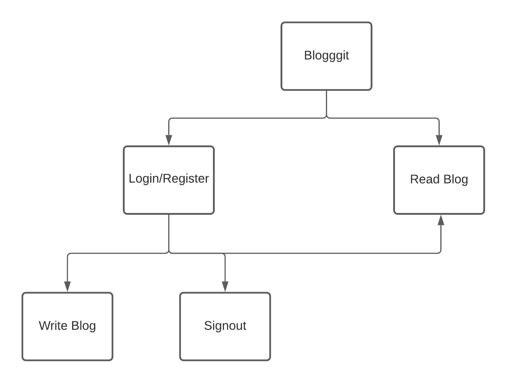
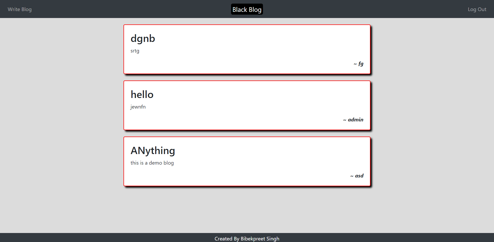
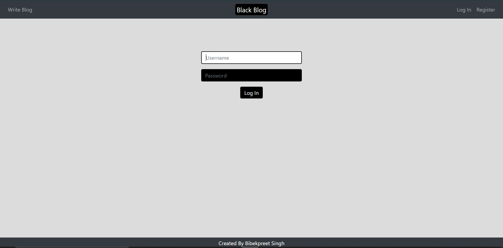
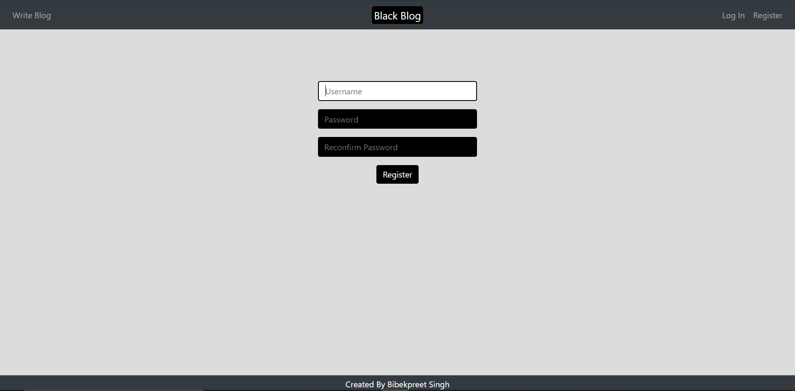
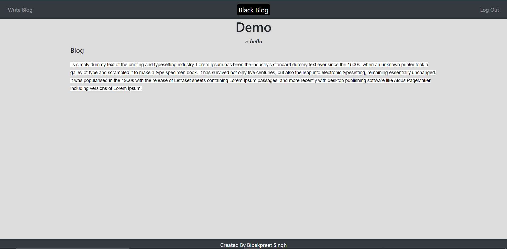
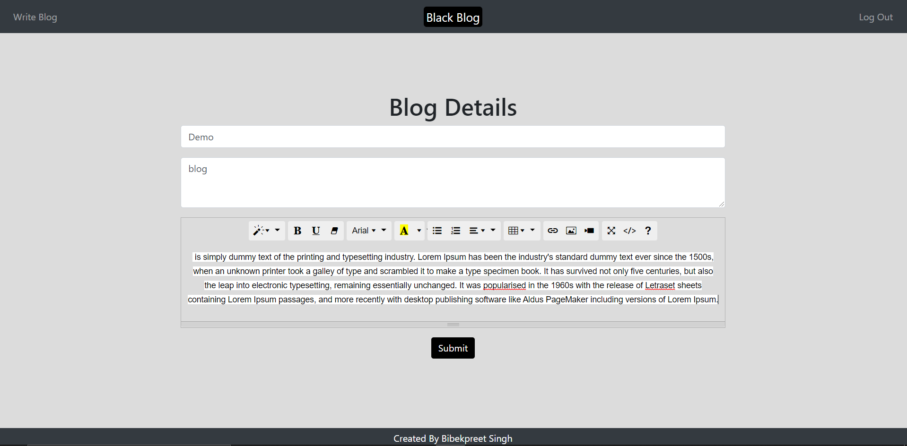

# Blogggit

### Overview
This is a blogging website where you can login and register yourself if you want to write and read blogs. Anyone can read blogs without loggin in.
Stack Used
1 Flask
2 SQLite3
3 HTML/CSS

### Live Link
https://blogggit.herokuapp.com

### Novelty
1. All the code is written and is not copied from anywhere.
2. All the designs and ideas are my own.
3. The logic to prevent anyone from writing without loggin in is developed.

### FlowChart

### Screenshots

